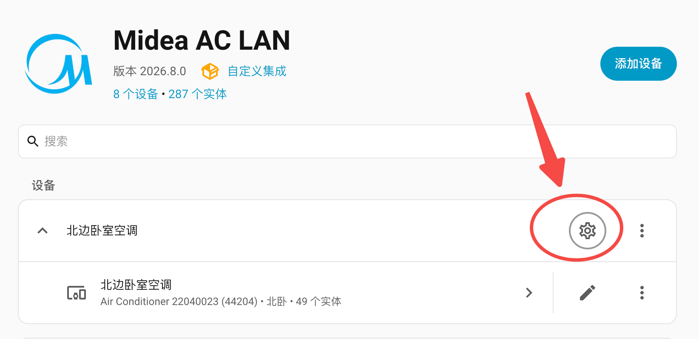
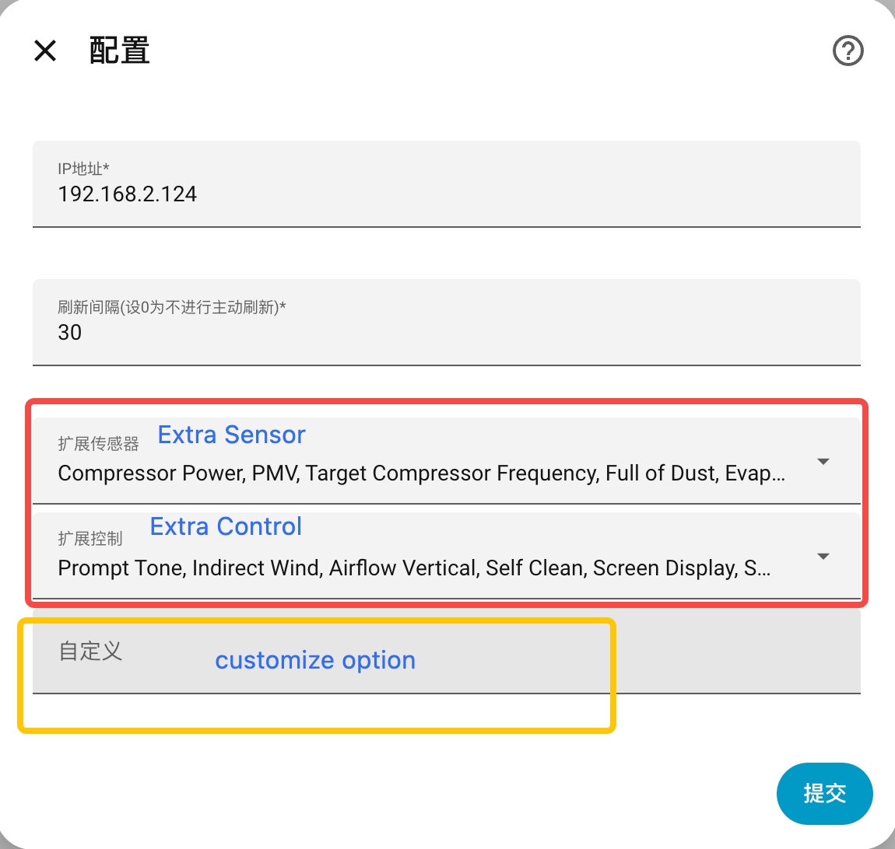

# Midea AC LAN

[](https://github.com/hacs/integration)
[](https://github.com/wuwentao/midea_ac_lan/releases/latest)

English | [简体中文](README_hans.md) | [Discord Chat](https://discord.com/invite/ZWdd2fXndn) | [QQ Group](https://qm.qq.com/q/l53SGEwlZ6)

Control your Midea M-Smart appliances over the local network.

- Discover and configure appliances from the Home Assistant UI.
- Create extra sensors and switches for appliance control.
- Keep a long-lived TCP connection to synchronize appliance status in real time.

⭐If this component is helpful for you, please star it, it encourages me a lot.

**_❗Note: This integration requires Home Assistant 2024.4.1 or higher_**

## 1. ❗❗❗❗❗❗Important Notice❗❗❗❗❗❗

> Note: Currently, only personal Meiju and SmartHome accounts can be used for login, and the appliance must be bound to that account. Otherwise, the appliance Token cannot be retrieved. NetHome Plus cannot retrieve Tokens for now, but the related options and functions are still retained.

1. The current Midea Meiju and SmartHome Token API services require login with a personal app account, and the appliance must be bound to that account before the Token can be retrieved. Midea may gradually close these Token API services in the future, which may prevent new appliances from being added.
2. For appliances that have been successfully added, please be sure to **copy or back up the appliance's `.json` configuration file to a device outside HAOS** for future use. Old v2 protocol appliances do not have `.json` configuration files, so only v3 protocol appliances need backups.
3. How to obtain the device's `.json` configuration file: Please refer to [Debug and Test](doc/debug.md#get-device-json-config)
4. Reason: During the initial design of the Midea v1 LAN API, it was assumed that client communication was already encrypted. Therefore, the tokens generated by the cloud service and used within this encrypted communication were not configured with an expiration time. However, many Home Assistant plugins on GitHub use cracked client encryption methods. Because these tokens cannot expire, this creates a security risk. Midea may therefore gradually shut down the cloud Token API services above and move to the new v2 cloud control API, which would eventually make the v1 LAN control API unavailable.

## 2. Upgrade from georgezhao2010/midea_ac_lan

1. Remove old [georgezhao2010/midea_ac_lan](https://github.com/georgezhao2010/midea_ac_lan) integration
2. [Install the current integration](#5-install-midea_ac_lan), then reboot HA
3. Your devices will NOT be deleted. They should still exist, so you do not need to discover or add them again.
4. If your appliance's switch or sensor entities disappear, re-enable them from `Settings -> Devices & Services -> Midea AC LAN -> Devices -> CONFIGURE`.
5. Done. Your appliances should work as before.

## 3. Supported brands

   \
   \
   \
   \
   \


And more.

## 4. Supported appliances

> **_❗Note: For each appliance type, configure supported features and parameters according to the documents below. Only enable a feature after confirming that the appliance supports it in the Midea app._**

Please check the document links below for the supported features and usage of each appliance type.

| Type | Name                       | Documents          |
| ---- | -------------------------- | ------------------ |
| 13   | Light                      | [13.md](doc/13.md) |
| 26   | Bathroom Master            | [26.md](doc/26.md) |
| 34   | Sink Dishwasher            | [34.md](doc/34.md) |
| 40   | Integrated Ceiling Fan     | [40.md](doc/40.md) |
| A1   | Dehumidifier               | [A1.md](doc/A1.md) |
| AC   | Air Conditioner            | [AC.md](doc/AC.md) |
| AD   | Air Box                    | [AD.md](doc/AD.md) |
| B0   | Microwave Oven             | [B0.md](doc/B0.md) |
| B1   | Electric Oven              | [B1.md](doc/B1.md) |
| B3   | Dish Sterilizer            | [B3.md](doc/B3.md) |
| B4   | Toaster                    | [B4.md](doc/B4.md) |
| B6   | Range Hood                 | [B6.md](doc/B6.md) |
| BF   | Microwave Steam Oven       | [BF.md](doc/BF.md) |
| C2   | Toilet                     | [C2.md](doc/C2.md) |
| C3   | Heat Pump Wi-Fi Controller | [C3.md](doc/C3.md) |
| CA   | Refrigerator               | [CA.md](doc/CA.md) |
| CC   | MDV Wi-Fi Controller       | [CC.md](doc/CC.md) |
| CD   | Heat Pump Water Heater     | [CD.md](doc/CD.md) |
| CE   | Fresh Air Appliance        | [CE.md](doc/CE.md) |
| CF   | Heat Pump                  | [CF.md](doc/CF.md) |
| DA   | Top Load Washer            | [DA.md](doc/DA.md) |
| DB   | Front Load Washer          | [DB.md](doc/DB.md) |
| DC   | Clothes Dryer              | [DC.md](doc/DC.md) |
| E1   | Dishwasher                 | [E1.md](doc/E1.md) |
| E2   | Electric Water Heater      | [E2.md](doc/E2.md) |
| E3   | Gas Water Heater           | [E3.md](doc/E3.md) |
| E6   | Gas Stove                  | [E6.md](doc/E6.md) |
| E8   | Electric Slow Cooker       | [E8.md](doc/E8.md) |
| EA   | Electric Rice Cooker       | [EA.md](doc/EA.md) |
| EC   | Electric Pressure Cooker   | [EC.md](doc/EC.md) |
| ED   | Water Drinking Appliance   | [ED.md](doc/ED.md) |
| FA   | Fan                        | [FA.md](doc/FA.md) |
| FB   | Electric Heater            | [FB.md](doc/FB.md) |
| FC   | Air Purifier               | [FC.md](doc/FC.md) |
| FD   | Humidifier                 | [FD.md](doc/FD.md) |

## 5. Install midea_ac_lan

### Option 1: Install via HACS

> [!IMPORTANT]
> Make sure you have installed HACS in Home Assistant using the [HACS install guide](https://hacs.xyz/docs/use/download/download/)

[](https://my.home-assistant.io/redirect/hacs_repository/?owner=wuwentao&repository=midea_ac_lan)

**Restart Home Assistant**.

### Option 2: Install with Script

> run this script in HA Terminal or SSH add-on

```shell
wget -O - https://github.com/wuwentao/midea_ac_lan/raw/main/scripts/install.sh | ARCHIVE_TAG=latest bash -
```

### Option 3: Manual Install

1. Download `midea_ac_lan.zip` from [Latest Release](https://github.com/wuwentao/midea_ac_lan/releases/latest)
2. Extract `midea_ac_lan.zip`.
3. Copy the extracted files into `/config/custom_components/midea_ac_lan` in Home Assistant, so `manifest.json` is directly under `/config/custom_components/midea_ac_lan/`.
4. **Restart Home Assistant**.

After restarting, open `[Settings]`, `[Device & services]`, `[Integrations]`, `[Midea AC Lan]` to finish the initial setup and add your appliances.

## 6. Add device

**_❗Note: First, set a static IP address for your appliance in the router, in case the IP address of the appliance changes after set-up._**

After installation, search for and add the `Midea AC LAN` integration from the Home Assistant integrations page. To add multiple appliances, add this integration multiple times and run automatic configuration each time.

Or click [](https://my.home-assistant.io/redirect/config_flow_start?domain=midea_ac_lan)

**_❗Note: During the configuration process, you will be asked to enter your Meiju or SmartHome account and password because appliance information (Token and Key) must be retrieved from the Midea cloud server. After all appliances are configured, please back up each v3 appliance `.json` configuration file for future use. See [Obtain Device JSON Configuration](doc/debug.md#4-obtain-device-json-configuration)._**

After the Midea account login is complete, click 'ADD DEVICE' to add an appliance. You can repeat this process to add multiple appliances.

> Note: Currently, only personal Meiju and SmartHome accounts can be used for login, and the appliance must be bound to that account. Otherwise, the appliance Token cannot be retrieved. NetHome Plus cannot retrieve Tokens for now, but the related options and functions are still retained.

### 6.1 Discover automatically

Using this option, the integration can discover and list Midea M-Smart appliances on the network or at a specified IP address. Select one from the list to add it.

You can also use an IP address to search within a specified network, such as `192.168.1.255`.

**_❗Note: Automatic discovery requires your appliances and Home Assistant to be in the same subnet. Otherwise, appliances cannot be discovered. You can enter an IP address directly instead._**

### 6.2 Configure manually

If you have manually configured the appliance through another integration before, or already have a Token/Key backup, you can add the appliance manually.

- Appliance code
- Appliance type (one of [Supported appliances](README.md#supported-appliances))
- IP address
- Port (default 6444)
- Protocol version
- Token
- Key

> Do not modify appliance configurations unless you know what you are changing. Adding an incorrect appliance configuration may cause abnormal appliance status or make control unavailable.

### 6.3 List all appliances only

Using this option, you can list all discoverable Midea M-Smart devices on the network, along with their IDs, types, SNs, and other information.

**_❗Note: Not all supported devices may be listed here. If a device cannot be scanned, it may not be supported at the moment._**

## 7. Configure

Configuration can be found in `Settings -> Devices & Services -> Midea AC LAN -> Devices -> CONFIGURE`.
You can reset the IP address when the appliance IP changes.
You can also add extra sensor and switch entities, or customize your appliance.

> ❗❗❗ After an appliance is added successfully, not all features are enabled by default. You still need to adjust the configuration, mainly by manually enabling or disabling features according to what the appliance supports.



### 7.1 IP address

Set the IP address of the appliance. You can reset this when the appliance IP changes.

### 7.2 Refresh interval

Set the interval for actively refreshing the status of a single appliance, in seconds. The default is 30, and 0 disables active refresh.
Most Midea appliances actively notify status changes, \
so HA status updates still work normally even if the refresh interval is set to "0". \
This component will also actively query the device status at regular intervals, and the default time is 30 seconds. \
Some appliances do not send active notifications when their status changes, so status synchronization in HA will be slower. \
If you are very concerned about the synchronization speed of the status, you can try to set a shorter status refresh interval.

**_❗Note: a shorter refresh interval may mean more resource consumption_**

### 7.3 Extra sensor and switch entities

After configuration, one or a few main entities (such as a climate entity) may be generated by default. If you want to expose other attributes as extra sensor or switch entities, click CONFIGURE in the Midea AC LAN integration card and select the sensors and switches to generate. Your appliance MUST support the selected features.
Refer to the documents for each appliance type before enabling them.

### 7.4 Customize

Some appliance types have their own customization items. You can use them to customize appliance features. If your appliance does not work properly, or if displayed values are abnormal, you may need customization to fix it. Refer to the appliance documentation for specific configuration information.

The format of `Customize` must be `JSON`.

If multiple customization items need to be configured, the settings must comply with the JSON format.

Example

```json
{ "refresh_interval": 15, "fan_speed": 100 }
```

> Whether `Customize` is supported depends on the appliance type. Refer to the corresponding appliance documentation.



## 8. Debug and Test

For getting debug logs or modifying source code, please refer to [Debug and Test](doc/debug.md).

## 9. Contributing Guide

Development uses [uv](https://docs.astral.sh/uv/) (no Docker required). Install uv, then:

```shell
git clone https://github.com/wuwentao/midea_ac_lan.git
cd midea_ac_lan
./scripts/setup.sh
```

See [CONTRIBUTING](.github/CONTRIBUTING.md) for full setup, running Home Assistant locally, and the code style / commit rules.
